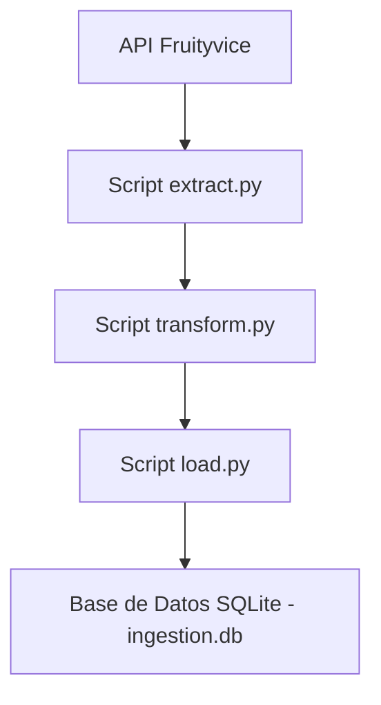

# 🔄 Documentación del Flujo ETL

Este proyecto realiza un proceso ETL (Extracción, Transformación y Carga) usando únicamente Python y SQLite.

---

##  1. Flujo General del ETL

### 1️ Extracción

- Fuente: API pública `https://www.fruityvice.com/api/fruit/all`
- Tipo de datos: JSON
- Información recuperada: nombre, familia, orden, y valores nutricionales de frutas.

### 2️ Transformación

- Limpieza de datos.
- Renombramiento de campos para mejor legibilidad.
- Conversión de estructuras anidadas en estructuras planas.

### 3 Carga

- Base de datos usada: SQLite (`ingestion.db`)
- Se crea una tabla `frutas` con los campos necesarios.
- Los datos se insertan con manejo de duplicados.

---

##  2. Diagrama del Flujo de Datos

Este flujo representa cómo los datos viajan desde la API hasta la base de datos local SQLite.
